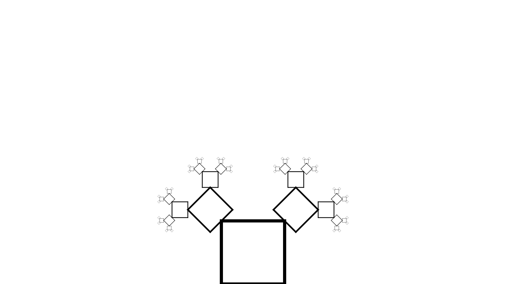
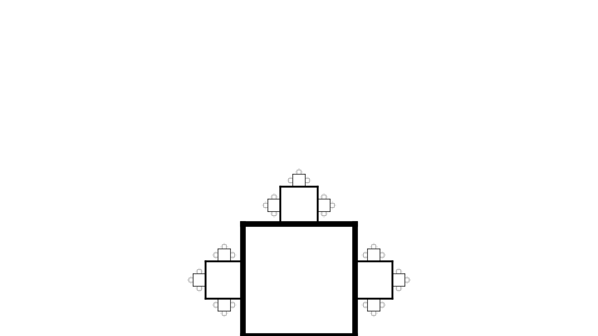
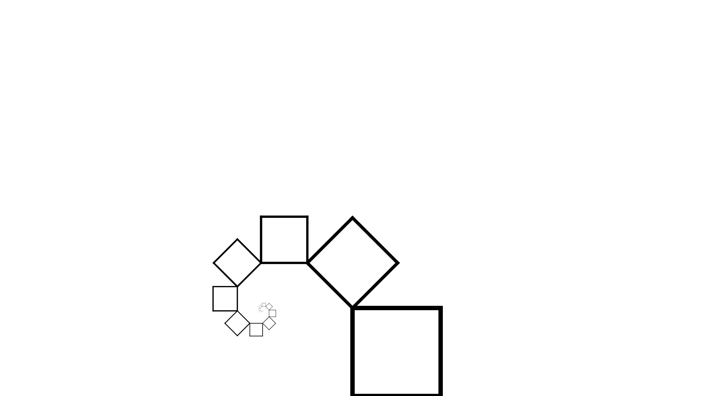
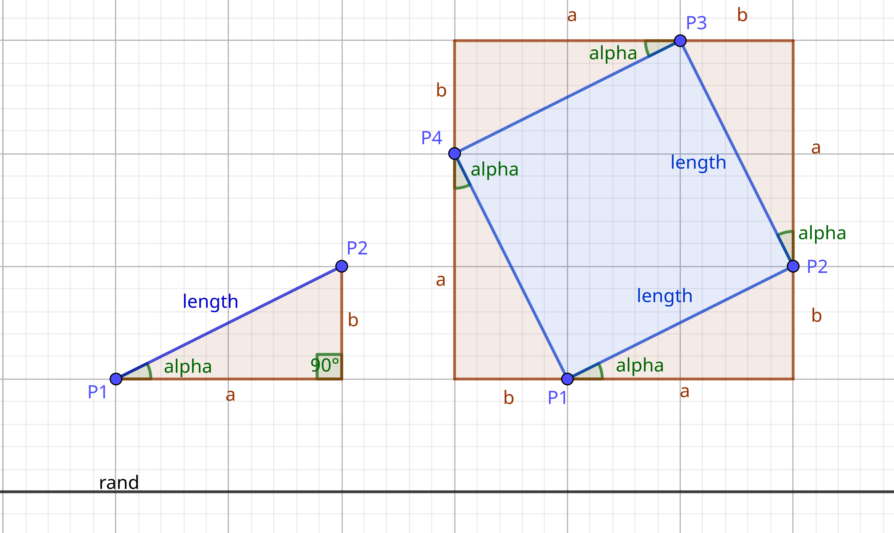
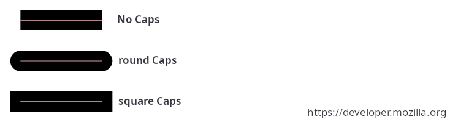

# G1 - Rekursive Figuren


Dieses Programm erstellt rekursive Figuren und speichert sie in einer SVG datei ab.

Ihr könnt ruhig selbst mit dem Programm rumspielen.  
Dafür müsst ihr nur das Programm runterladen und die konstanten Variablen in dem ```## SETTINGS ##``` Abschnitt nach belieben verändern.

## Vokabeln & Vorwissen

Dieses Programm macht viel mit dem SVG Standart. Mehr zu wie es das macht und eine kleine Übersicht [hier](docs/svg.md).

Eine kleine Liste an wichtigen Vokabeln: (Ja, ich weiß; das ist alles ein schreckliches Deutsch-Englisch Gemisch)
 - **Node**: so werden oft die verschiedenen Knotenpunkte einer rekursiven Struktur genannt. In userem Programm zeichnet aber jede Node außerdem eine "Figur"
 - **Figur**: die einfache Form, die rekursiv gezeichnet wird. [Hier](assets/title_image.png) ist die Figur eine Line. Sie kann aber auch ein Dreieck oder Quadrad (oder jegliche andere Form) sein
 - **Parent**: eine Parent Node ist einfach die Node, die die Child Node hervorgerufen hat. Könnt ihr euch so ähnlich wie beim Stammbaum vorstellen.
 - **Child**: siehe ```Parent```
 - **Mother node**: Die allererste Node. Sie wird in der Regel im Programm direkt aufgerufen.

## Einstellungen
 
*Note*: Einige Erklärungen machen möglicheweise keinen Sinn, wenn ihr das Programm noch nicht versteht

| Einstellung               | mögliche Werte   | Erklärung                                               |
| :------------------------ | :--------------- | :------------------------------------------------------ |
| **General**                                                                                            |
| ```mode```                | "line", "quad"   | Die Formen die erstellt werden sollen                   |
| ```submode```             | None, "pythagoras" | Ein weiterführender Modus, der für manche spezielle Figuren nötig ist |
| ```start```               | "top", "bottom", "mid" | Wo die Figur anfangen sollte                      |
|                                                                                                        |
| **Board**                                                                                              |
| ```heigth```              | pos. float       | Die Höhe des SVGs                                       |
| ```width```               | pos. float       | Die Breite des SVGs                                     |
|                                                                                                        |
| **Size**                                                                                               |
| ```initial_size```        | pos. float       | die Größe der ersten Generation                         |
| ```dropoff```             | float            | wie schnell die Größe & Linienbreite sich verändert     |
| ```exponential_dropoff``` | bool             | ob die Größe exponentiell kleiner werden soll           |
| ```line_width```          | pos. float       | die Linienbreite, abhänging von der Länge               |
|                                                                                                        |
| **Rotation**                                                                                           |
| ```keep_rotation```       | bool             | ob die Rotation vererbt werden soll                     |
| ```spread```              | -360 zu 360      | die rotation des childs dem parent gegenüber            |
|                                                                                                        |
| **Colour**                                                                                             |
| ```colour_background```   | hex colour str   | Die Farbe des Hintergrundes. ```None``` für keine       |
| ```colour_lines```        | hex colour str   | Die Farbe der linien. ```None``` für keine              |
|                                                                                                        |
| **Location**                                                                                           |
| ```anchor_child```        | "corner", "edge" | An welcher Stelle des Childs C1-4 liegt                 |
| ```anchor_parent```       | "corner", "edge" | An welcher Stelle des Parents C1-4 liegt                |
|                                                                                                        |
| **Generations & Children**                                                                             |
| ```max_generations```     | pos. int         | Die anzahl an generationen, die generiert werden sollen |
| ```children_count```      | pos int          | Wie viele children jedes mal generiert werden sollen    |

**Tipp**: Spielt einfach mit den Einstellungen rum, um rauszufinden was sie tun.

### Voreinstellungen

---

<details>
  <summary> Einstellungen für das Titelbild</summary>

  

  | Einstellung               | Wert           |
  | :-----------------        | :------------- |
  | **General**                                |
  | ```mode```                | "line"         |
  | ```submode```             | None           |
  | ```start```               | "top"          |
  | **Board**                                  |
  | ```heigth```              | 900            |
  | ```width```               | 1600           |
  | **Size**                                   |
  | ```initial_size```        | 200            |
  | ```dropoff```             | 1.38           |
  | ```exponential_dropoff``` | True           |
  | ```line_width```          | 1/20           |
  | **Rotation**                               |
  | ```keep_rotation```       | True           |
  | ```spread```              | None           |
  | **Colour**                                 |
  | ```colour_background```   | None           |
  | ```colour_lines```        | "#FFFFFF"    |
  | **Location**                               |
  | ```anchor_child```        | "corner"       |
  | ```anchor_parent```       | "corner"       |
  | **Generations & Children**                 |
  | ```max_generations```     | 10             |
  | ```children_count```      | 2              |

</details>

<details>
  <summary> Einstellungen für den Quadratbaum</summary>

  

  | Einstellung               | Wert           |
  | :-----------------        | :------------- |
  | **General**                                |
  | ```mode```                | "quad"         |
  | ```submode```             | None           |
  | ```start```               | "bottom"       |
  | **Board**                                  |
  | ```heigth```              | 900            |
  | ```width```               | 1600           |
  | **Size**                                   |
  | ```initial_size```        | 200            |
  | ```dropoff```             | 2              |
  | ```exponential_dropoff``` | True           |
  | ```line_width```          | 1/20           |
  | **Rotation**                               |
  | ```keep_rotation```       | True           |
  | ```spread```              | 45             |
  | **Colour**                                 |
  | ```colour_background```   | "#FFFFFF"    |
  | ```colour_lines```        | "#000000"    |
  | **Location**                               |
  | ```anchor_child```        | "edge"         |
  | ```anchor_parent```       | "corner"       |
  | **Generations & Children**                 |
  | ```max_generations```     | 5              |
  | ```children_count```      | 2              |

</details>

<details>
  <summary> Einstellungen für die Quadratpflanze</summary>

  

  | Einstellung               | Wert           |
  | :-----------------        | :------------- |
  | **General**                                |
  | ```mode```                | "quad"         |
  | ```submode```             | None           |
  | ```start```               | "bottom"       |
  | **Board**                                  |
  | ```heigth```              | 900            |
  | ```width```               | 1600           |
  | **Size**                                   |
  | ```initial_size```        | 300            |
  | ```dropoff```             | 3              |
  | ```exponential_dropoff``` | True           |
  | ```line_width```          | 1/20           |
  | **Rotation**                               |
  | ```keep_rotation```       | True           |
  | ```spread```              | 90             |
  | **Colour**                                 |
  | ```colour_background```   | "#FFFFFF"    |
  | ```colour_lines```        | "#000000"    |
  | **Location**                               |
  | ```anchor_child```        | "edge"         |
  | ```anchor_parent```       | "edge"         |
  | **Generations & Children**                 |
  | ```max_generations```     | 4              |
  | ```children_count```      | 3              |

</details>

<details>
  <summary> Einstellungen für die Quadratspirale</summary>

  

  | Einstellung               | Wert           |
  | :-----------------        | :------------- |
  | **General**                                |
  | ```mode```                | "quad"         |
  | ```submode```             | None           |
  | ```start```               | "bottom"       |
  | **Board**                                  |
  | ```heigth```              | 900            |
  | ```width```               | 1600           |
  | **Size**                                   |
  | ```initial_size```        | 200            |
  | ```dropoff```             | 1.38           |
  | ```exponential_dropoff``` | True           |
  | ```line_width```          | 1/20           |
  | **Rotation**                               |
  | ```keep_rotation```       | True           |
  | ```spread```              | 45             |
  | **Colour**                                 |
  | ```colour_background```   | "#FFFFFF"    |
  | ```colour_lines```        | "#000000"    |
  | **Location**                               |
  | ```anchor_child```        | "corner"       |
  | ```anchor_parent```       | "corner"       |
  | **Generations & Children**                 |
  | ```max_generations```     | 10             |
  | ```children_count```      | 1              |

</details>

<details>
  <summary> Einstellungen für den Pythagoras-Baum</summary>

  

  | Einstellung               | Wert           |
  | :-----------------        | :------------- |
  | **General**                                |
  | ```mode```                | "quad"         |
  | ```submode```             | "pythagoras"   |
  | ```start```               | "bottom"       |
  | **Board**                                  |
  | ```heigth```              | 900            |
  | ```width```               | 1600           |
  | **Size**                                   |
  | ```initial_size```        | 200            |
  | ```dropoff```             | 1.2            |
  | ```exponential_dropoff``` | True           |
  | ```line_width```          | 1/20           |
  | **Rotation**                               |
  | ```keep_rotation```       | True           |
  | ```spread```              | 30             |
  | **Colour**                                 |
  | ```colour_background```   | "#FFFFFF"    |
  | ```colour_lines```        | "#000000"    |
  | **Location**                               |
  | ```anchor_child```        | "corner"       |
  | ```anchor_parent```       | "corner"       |
  | **Generations & Children**                 |
  | ```max_generations```     | 14             |
  | ```children_count```      | 1              |

</details>

<details>
  <summary> Einstellungen für das Sierpinski-Dreieck</summary>

  

  **NICHT MÖGLICH MIT [```main.py```](main.py); BENUTZE [```triangle.py```](triangle.py)**

</details>

---

## Kurzer Überblick des Programmes

Importieren des "math" modules für sinus, cosinus, pi, etc:

```python
import math
```

### SVG Zeug

---

Deklaration von ganz schön viel Zeugs, um mit SVGs zu interagieren.  
Keine Sorge: das sieht schlimmer aus, als es ist!

Die Datei öffnen, leeren (damit wir keine alten Daten mehr haben) und den xml + svg header reinschreiben:

```python
## SVG STUFF ##
# Diese Funktion schreibt den SVG header und den Hintergrund in die SVG Datei
def init_file(filename):
  open(filename, 'w').close() # SVG Datei leeren
  to_file('<?xml version="1.0" encoding="UTF-8"?>') # xml header
  to_file(f'<svg xmlns="http://www.w3.org/2000/svg" width="{str(svg_width)}" height="{str(svg_height)}">') # svg header

  # Hintergrund
  if not (colour_background is None):
    to_file(f'<rect width="{str(svg_width)}" height="{str(svg_height)}" fill="{colour_background}" />')
  # Kleiner contents marker; macht die svg Datei weningstents ein bisschen übersichtlicher
  to_file('<!-- vv Contents vv -->\n')
```

---

Eine super einfache Funktion, um mit nur einem Befehl Daten in die SVG zu schreiben:

```python
# Diese Funktion schreibt strings in die SVG Datei
def to_file(contents: str):
  try: # Error handling
    with open(file, 'a') as f: # SVG Datei öffnen
      f.write(contents + "\n") # Contents in die SVG Datei schreiben
  except: # (try-except-struktur: wenn die Befehle oben einen Crash produzieren, wird stattdessen der Code hier vv ausgeführt)
    print("Error writing to svg file!")
```

Hier benutzen wir eine Try-Except-Struktur, die wir im Unterricht noch nicht hatten.  
Diese Strukturen können benutzt werden um Crashes vorzubeugen:  
Sollte eigentlich das Programm, aufgrund des Codes unter ```try```, crashen, führt Python einfach stattdessen den Code unter ```except``` aus.

Mit ```with open(pfad_zur_datei, modus) as variablenname``` kann man in Python Dateien als ein Text öffnen.  
Wir benutzen: 

```python
with open(file, 'a') as f:
```

Also:
 - Datei: Inhalt der ```file``` variable (also 'image.svg')
 - Modus: ```a```: append mode; wir werden den Inhalt der Datei nicht ersetzen, sondern anhängen
 - Name: ```f```: steht für 'file' (dieser Name ist ja aber schon vergeben); ist die Variable, welche die Datei representiert, mit der wir arbeiten, wenn wir die Datei bearbeiten wollen.

Und dann können wir neue Linien mit ```f.write(some_string)``` hinzufügen:

```python
f.write(contents + "\n")
```

*Note*: ```\n``` bedeutet 'newline', also eine neue zeile, denn 'write' fügt nicht automatisch einen Zeilenumbruch hinzu.

*Note*: Wir benutzen hier kein ```f.close()```, da ```with``` das für uns macht.

Mehr infos zu Python's ```open``` Befehl [hier](https://docs.python.org/3/library/functions.html#open).

---

Wie der Kommentar sagt, diese Funktion fügt eine Linie zu der SVG Datei hinzu:

```python
# Diese Funktion schreibt (bzw. "malt") eine linie in die SVG Datei
def draw_line(x1: float, y1: float, x2: float, y2: float, 
              width: float,
              colour: str = "#000000",
              comment: str = None,
              addtional_option: str = None
              ):
  # Grund-String
  line_str = f'<line x1="{str(x1)}" y1="{str(y1)}" x2="{str(x2)}" y2="{str(y2)}" stroke="{colour}" stroke-width="{str(width)}"'
  # Extra optionen
  if not (addtional_option is None): line_str = line_str + " " + addtional_option

  # Ende line funktion
  line_str = line_str + ' />'

  # Kommentar
  if not (comment is None): line_str = line_str + f' <!-- {comment} -->'
  to_file(line_str)
```

Diese Linie geht von P¹(x1|y1) zu P²(x2|y2). (Diese Punkte werden noch seeeehr wichtig..)

Wenn du mehr über svg-line wissen willst, kannst du [hier](docs/svg.md#linie) mehr finden.

Die Argumente (x1,x2,y1,y2,width,colour) werden dann mithilfe von [f-strings](https://docs.python.org/3/tutorial/inputoutput.html#tut-f-strings) in den String eingegeben.

Sollte der Kommentar nicht 'None' sein, hängen wir dann noch den Komentar ran. (Komentare in xml werden mit ```<!-- Kommentar Hier -->``` definiert, nicht mit ```# Kommentar hier```, wie in Python)

Danach schreiben wir alles in die Datei (mithilfe unserer ```to_file``` Funktion von oben).

---

### Mathe

---

Jetzt sollten wir mal kurz ein bisschen Theorie machen..

Eine Node ist ein Teil einer rekursiven Figur. In unserem Fall malt die Node die simple Form, aus der die rekursive Figur besteht.

Mit der "mode" Einstellung können wir die Form der Nodes verändern:

  - entweder wir benutzen "line", also eine Line von P1 zu P2

  - oder "quad", also ein Quadrat von P1, P2, P3 und P4

---

Hier kurz eine Darstellung:



Der Winkel ```alpha``` ist bereits durch die Variable ```child_spacing``` und dadurch die Einstellung ```spread``` gegeben.  
```length``` haben wir auch schon gegeben (durch ```node_length```) und da:

```
cos(alpha) = a / length
sin(alpha) = b / length
```

also:

```
a = cos(alpha) * length
b = sin(alpha) * length
```

und dadurch können wir dann die X,Y-Koordinaten von P2-4 berechnen:

```
P2_x = P1_x + a
P2_y = P1_y - b

P3_x = P1_x + a - b
P3_y = P1_y - a - b

P4_x = P1_x - b
P4_y = P1_y - a
```

---

Wollen wir dann aber die Mitte der Seiten berechnen, müssen wir nur ```length / 2``` anstatt von ```length``` eingeben:  
(Wir nennen diese Punkte mal E1-4 und nein, ich habe hierfür keine Darstellung)

```
c = cos(alpha) * (length / 2)
d = sin(alpha) * (length / 2)

E1_x = P1_x + c
E1_y = P1_y - d

E2_x = P1_x + a - d
E2_y = P1_y - b - c

E3_x = P1_x + a - b - c
E3_y = P1_y - a - b + d

E4_x = P1_x - b + d
E4_y = P1_y - a + c
```

Die Punkte E1-4 können wir dann benutzen um Children an den Anchors ```edge```, anstatt an den ```corners``` zu generieren.

Wir können auch P1 von E1 generieren, wenn ```anchor_child``` auf ```edge``` gesetzt ist:

```
P1_x = origin_x - c
P1_y = origin_y + d
```

---

### Umsetzung im Code

---

Node Argumente:

```python
def node(origin_x, origin_y, generation, alpha, node_length)
```

Eine kleine Sache, die uns echt für eine Weile beschäftigen kann (den Fehler habe ich schon gemacht :) ) ist, dass Python mit Radial, nicht mit Degrees arbeitet, also müssen wir erst umformen:

```python
alpha_rad = alpha * (math.pi / 180)
```

---

Danach können wir ohne Probleme P1-4 & E1-4 berechnen: (siehe [hier](README.md#mathe))

```python
## BERECHNUNG FÜR P1-4 ##

# X & Y offset berechnen
a = math.cos(alpha_rad) * node_length
b = math.sin(alpha_rad) * node_length

c = math.cos(alpha_rad) * (node_length / 2)
d = math.sin(alpha_rad) * (node_length / 2)


# Optionale Debug Infos
if debug: print(f"Gen: {generation} Alpha: {alpha} a: {round(a)} b: {round(b)}")

# Berechnen der Eck-Koordinaten
if anchor_child == "corner":
  P1_x = origin_x
  P1_y = origin_y
elif anchor_child == "edge":
  P1_x = origin_x - c
  P1_y = origin_y + d

P2_x = P1_x + a
P2_y = P1_y - b

P3_x = P1_x + a - b
P3_y = P1_y - a - b

P4_x = P1_x - b
P4_y = P1_y - a


# BERECHNUNG FÜR E1-4 ##
# E-Punkte sind in der Mitte der Seiten

# Berechenen
E1_x = P1_x + c
E1_y = P1_y - d

E2_x = P1_x + a - d
E2_y = P1_y - b - c

E3_x = P1_x + a - b - c
E3_y = P1_y - a - b + d

E4_x = P1_x - b + d
E4_y = P1_y - a + c
```

---

Debug infos:

```python
if debug and (mode == "quad"): print(f"Gen: {generation} P1({round(P1_x)}|{round(P1_y)}) P2({round(P2_x)}|{round(P2_y)}) P3({round(P3_x)}|{round(P3_y)}) P4({round(P4_x)}|{round(P4_y)})")
```

---

Und jetzt müssen wir die Form der Node zeichnen:

Für lines:

```python
if mode == "line":
  draw_line(x1=P1_x, y1=P1_y, x2=P2_x, y2=P2_y, 
            width=(node_length * line_width), 
            colour=colour_lines, 
            comment=f"Gen: {generation}")
```

Ist ja super einfach, nur eine Linie von P1 zu P2

Für Quadrate:

```python
elif mode == "quad":
  to_file(f'<!-- Gen {generation} Quad -->')
  draw_line(x1=P1_x, y1=P1_y, x2=P2_x, y2=P2_y, 
        width=(node_length * line_width), 
        colour=colour_lines if not debug else "#FF0000", # red
        comment=f"q1; Gen{generation}",
        addtional_option='stroke-linecap="square"')
  draw_line(x1=P2_x, y1=P2_y, x2=P3_x, y2=P3_y, 
        width=(node_length * line_width), 
        colour=colour_lines if not debug else "#00FF00", # green
        comment=f"q2; Gen{generation}",
        addtional_option='stroke-linecap="square"')
  draw_line(x1=P3_x, y1=P3_y, x2=P4_x, y2=P4_y, 
        width=(node_length * line_width), 
        colour=colour_lines if not debug else "#0000FF", # blue
        comment=f"q3; Gen{generation}",
        addtional_option='stroke-linecap="square"')
  draw_line(x1=P4_x, y1=P4_y, x2=P1_x, y2=P1_y, 
        width=(node_length * line_width), 
        colour=colour_lines if not debug else "#FFFF00", # yellow
        comment=f"q4; Gen{generation}",
        addtional_option='stroke-linecap="square"')
  to_file(f'<!-- Gen {generation} Quad End -->')
```

Das ist ein bisschen viel, ich sollte also am besten erklären:

Eingetlich zeichen wir nur linien von P1 zu P2, P2 zu P3, P3 zu P4, P4 zu P1.  
Allerdings haben wir ohne Linecaps eine fehlende Ecke:


Hier eine kleine Übersicht über linecaps:



Um die Ecken des Quadrats voll auszufüllen, müssen wir nur squarecaps benutzen:

```python
addtional_option='stroke-linecap="square"'
```

---

Nachdem wir die Figur gezeichnet haben, müssen wir den ganzen "rekursiv" Teil machen: das generieren der Children.

Erstmal müssen wir nartülich dafür sorgen das wir nicht eine Unendliche Rekursionstiefe erreichen:

```python
if generation < max_generations:
```

Nun müssen wir ```child_spacing``` ermittlen:

```python
if (spread is None) or mode == "line": child_spacing = 180 / children_count
else: child_spacing = spread
```

Dann die Länge der Children:

```python
if exponential_dropoff: child1_length = node_length / dropoff
else: child1_length = initial_size / ((generation+1) * dropoff + 1)
```

Nun müssen wir die Child Spawns aussuchen: (Abhänging von ```anchor_parent```)

```python
if anchor_parent == "corner":
  C1_x = P4_x # Also: child 1 wird bei P4 generiert
  C1_y = P4_y

  C2_x = P3_x
  C2_y = P3_y

  C3_x = P2_x
  C3_y = P2_y

  C4_x = P1_x
  C4_y = P1_y

elif anchor_parent == "edge":
  C1_x = E4_x # Also: child 1 wird bei Q4 generiert
  C1_y = E4_y

  C2_x = E3_x
  C2_y = E3_y

  C3_x = E2_x
  C3_y = E2_y

  C4_x = E1_x
  C4_y = E1_y
```

Da normalerweise alle Children gleich orentiert sind, nicht gleichmäßing nach außen, müssen wir die Drehung erst ausgleichen:

```python
# Rotation
r1 = 0
r2 = 270
r3 = 180
r4 = 90
```

Sollten ```submode``` auf ```pythagoras``` gestellt sein, brauchen wir noch ein paar mehr infos, aber darüber reden wir [hier](README.md#submodules)

---

Danach gehen wir einfach durch die anzahl der Children durch: (Gegebenenfalls durch ```initial_children_count```)

```python
for i in range(children_count if (generation != 0) or (initial_children_count is None) else initial_children_count):
```

und führen folgenden Code aus:

Für Linien:

```python
if mode == "line":
  child_rotation = (i+0.5) * child_spacing + alpha - 90
  node(P2_x, P2_y, generation+1, child_rotation, child1_length)
```

Für Quadrate:

```python
elif mode == "quad":
  match i+1:
    case 1: # links-oben --> an Ecke P4 / Seite E4
      node(C1_x, C1_y, generation+1, r1 + alpha + child_spacing, child1_length)
    case 2: # rechts-oben --> an Ecke P3 / Seite E3
      node(C2_x, C2_y, generation+1, r2 + alpha + child_spacing, child1_length)
    case 3: # rechts-unten --> an Ecke P2 / Seite E2
      node(C3_x, C3_y, generation+1, r3 + alpha + child_spacing, child1_length)
    case 4: # links-unten --> an Ecke P1 / Seite E1
      node(C4_x, C4_y, generation+1, r4 + alpha + child_spacing, child1_length)
    ## Sollte i+1 > 4 --> nichts
```

(Bei den Quadraten müssen ja die (maximal) vier Children an den Verschiedenen Punkten, nicht immer am gleichen generieren)

Da beim Pythagoras-Baum statt einem Child, immer zwei geneiert werden müssen sieht das dann so aus:

```python
elif mode == "quad":
  match i+1:
    case 1: # links-oben --> an Ecke P4 / Seite E4
      node(C1_x, C1_y, generation+1, r1 + alpha + child_spacing, child1_length)
      if submode == "pythagoras": node(C1_P2_x, C1_P2_y, generation+1, (child_spacing + alpha + (beta - 180) + r1), child2_length)
    case 2: # rechts-oben --> an Ecke P3 / Seite E3
      node(C2_x, C2_y, generation+1, r2 + alpha + child_spacing, child1_length)
      if submode == "pythagoras": node(C2_P2_x, C2_P2_y, generation+1, (child_spacing + alpha + (beta - 180) + r2), child2_length)
    case 3: # rechts-unten --> an Ecke P2 / Seite E2
      node(C3_x, C3_y, generation+1, r3 + alpha + child_spacing, child1_length)
      if submode == "pythagoras": node(C3_P2_x, C3_P2_y, generation+1, (child_spacing + alpha + (beta - 180) + r3), child2_length)
    case 4: # links-unten --> an Ecke P1 / Seite E1
      node(C4_x, C4_y, generation+1, r4 + alpha + child_spacing, child1_length)
      if submode == "pythagoras": node(C4_P2_x, C4_P2_y, generation+1, (child_spacing + alpha + (beta - 180) + r4), child2_length)
```

---

Nun müssen wir das ganze nur noch ausführen.  
Dazu rufen wir als aller erstes ```init_file``` auf:

```python
init_file(file)
```

Dann brauchen wir, abhängig von den Einstellungen, ```origin_x``` und ```origin_y``` der Mothernode:

```python
if (mode == "quad") and (anchor_child != "edge"): startx = (svg_width / 2) - (initial_size / 2)
else:                                             startx = (svg_width / 2)

if start == "top":
  starty = 0
elif start == "mid":
  if mode == "quad": starty = (svg_height / 2) + (initial_size / 2)
  else:              starty = svg_height / 2
elif start == "bottom":
  starty = svg_height
```

*Note*: Der Code ist ziehmlich selbsterklärend, daher werden ich nicht weiter drauf eingehen (Mach doch ein [issue](https://github.com/IamLegende7/G1-recursive-trees/issues/new) auf)

Und dann; der Star der Show:

```python
# Aufrufen der Mothernode
node(origin_x=startx,
     origin_y=starty,
     generation=0,
     alpha=0,
     node_length=initial_size)
```

---

Zum Schluss braucht die SVG Datei noch ihren Footer:

```
to_file('\n</svg>')
```

### Submodules

---

**Pythagoras**:

Extra Infos: (bin zu faul das genauer zu erklären) [TODO: weiter ausführen]


```python
if submode == "pythagoras":
  child2_length = math.sin(child_spacing * (math.pi / 180)) * node_length
  beta = 180 - child_spacing - (math.asin(child1_length / node_length) * (180 / math.pi))     # 180° - child_spacing - gamma = beta, denn alpha + beta + gamma = 180°

  if debug: print(f'Alpha: {round(alpha)} Beta: {round(beta)} Gamma: {round(math.asin(child1_length / node_length) * (180 / math.pi))} Spacing: {round(child_spacing)}')

  child_a = math.cos((r1 + alpha + child_spacing) * (math.pi / 180)) * child1_length
  child_b = math.sin((r1 + alpha + child_spacing) * (math.pi / 180)) * child1_length

  C1_P2_x = C1_x + child_a
  C1_P2_y = C1_y - child_b

  C2_P2_x = C2_x + child_b
  C2_P2_y = C2_y + child_a

  C3_P2_x = C3_x - child_a
  C3_P2_y = C3_y + child_b

  C4_P2_x = C4_x - child_b
  C4_P2_y = C4_y - child_a
```

# Und das war's auch schon!

Nicht sonderlich kompliziert, oder?  
Bei Problemen oder Fragen könnt ihr mich ja in der Schule ansprechen, mir auf Whatsapp schreiben oder ein [Github Issue](https://github.com/IamLegende7/G1-recursive-trees/issues/new) aufmachen.